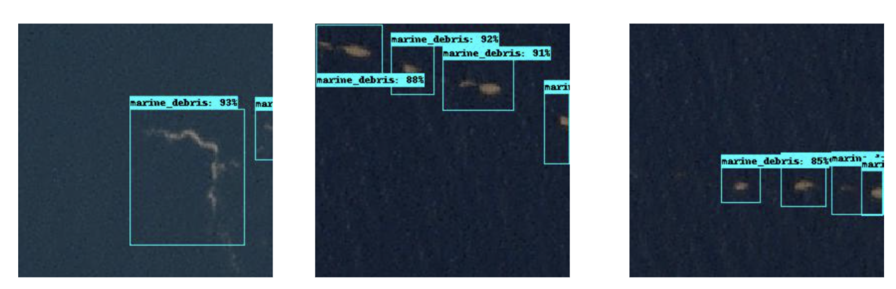
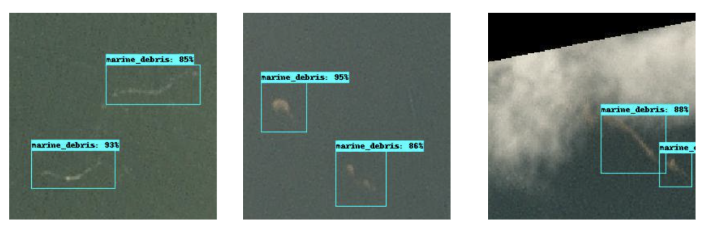
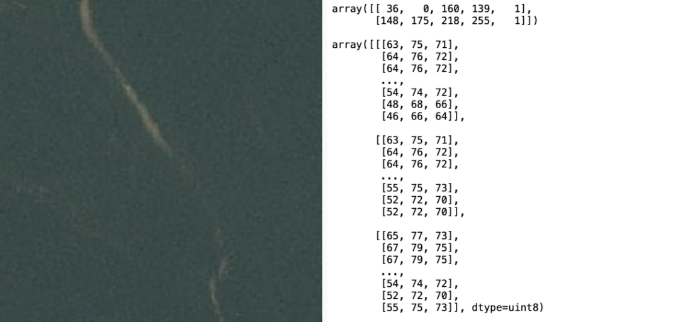
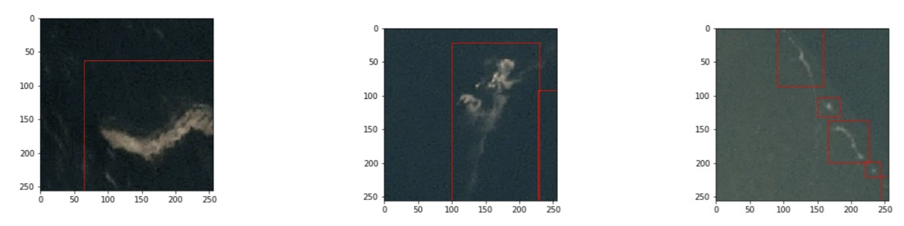
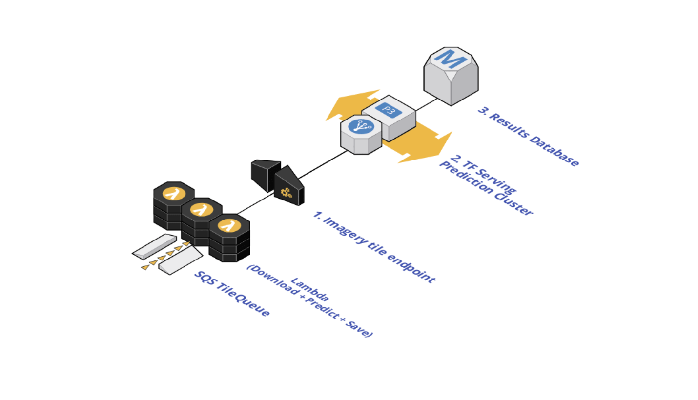
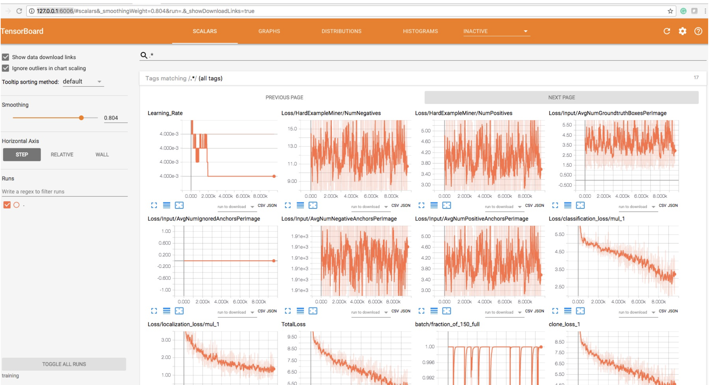
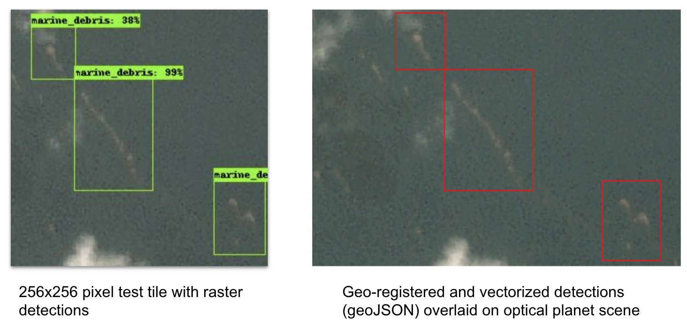

# Marine debris detection with commercial satellite imagery and deep learning.

Floating marine debris is a global pollution problem which threatens marine and human life and leads to the loss of biodiversity. Large swaths of marine debris are also navigational hazards to vessels. Artificial intelligence, specifically deep learning, can be used to detect floating marine debris in satellite imagery. In this project, we seek to demonstrate the strong potential of using commercial small satellite imagery for detecting marine debris pollution and strengthening current and future efforts to clean the oceans. We present an application of a deep learning model designed for object detection in the TensorFlow framework for observing marine debris floating on the surface of the ocean. The model was trained on our custom-labeled dataset of 1370 polygons containing marine debris as observed in [Planetscope optical imagery](https://www.planet.com/products/planet-imagery/). An overall precision score of 0.78 and recall score of 0.70 were obtained on the test dataset. 

*Model performance on test images:*



*Paper and dataset forthcoming.*

## Overview

### 1. Data

Planet small satellite imagery is utilized in this study. Specifically, the 3-meter imagery product called Planetscope. This imagery has four bands namely red, green, blue, and near-infrared. The combination of fairly high spatial resolution, high temporal resolution, availability of a near-infrared channel and global coverage of coastlines made this imagery quite advantageous for the purposes of this research. With these imagery specifications as well as plastic size and ghost fishing net size categories, we anticipated our model would be capable of detecting aggregated debris flotsam as well as some mega plastics including medium to large size ghost fishing nets.

Using the Planet Explorer, specific image scenes consisting of visible marine debris patches were selected for our training dataset. This step involved manually exploring Planetscope scenes and verifying the presence of marine debris. For this initial study, we decided to focus our efforts on detecting marine debris from optical (red, green, blue) channel imagery. Initial investigation into the utility of the Planetscope near-infrared channel was conducted, and future work will integrate the near-infrared channel.

We used [Image Labeler](https://impact.earthdata.nasa.gov/labeler/) to manually digitize bounding box annotations for observable debris on Planetscope optical imagery. A total of 1370 bounding boxes were labeled on the image scenes. This constituted the initial training, testing and validation dataset for object detection modeling.

The next task was to prepare the dataset in model-ready format, which entailed tiling the image scenes into smaller frames and encoding the bounding boxes into coordinate arrays with numerical class ids. The need for tiling the imagery stems from computational efficiency at model runtime. To accomplish these tasks, we used [Label Maker (LM)](https://github.com/developmentseed/label-maker). We used zoom level 16 as it most closely approximates the native spatial resolution of Planetscope imagery. An example configuration file for use with LM is located at *data_utils/config.json*. Finally, the dataset in compressed array format (.npz) was used to create binary TensorFlow Records datasets.

Tiled image with labels.npz entry. On the right are the bounding box annotation coordinates `[xmin, ymin, xmax, ymax]` and `class ID 1`, with the image array on the bottom:


Tiled images with plotted annotations:


### 2. Model
Our architecture of choice for this project is [SSD Resnet 101 Feature Pyramid Network (FPN)](https://arxiv.org/abs/1708.02002), which we've implemented with the [Tensorflow Object Detection API](https://github.com/tensorflow/models/tree/master/research/object_detection). We employed a weighted sigmoid focal loss
and transfer learning for our baseline model from a [pre-trained resnet 101 checkpoint](http://download.tensorflow.org/models/object_detection/ssd_resnet101_v1_fpn_shared_box_predictor_oid_512x512_sync_2019_01_20.tar.gz) hosted on Tensorflow model zoo. Our best model currently performs with a test F1 score of 0.74.

After training is complete, we export the best model to [TensorFlow serving format](https://www.tensorflow.org/tfx/guide/serving), package the trained model weights and inference code into a [Docker](https://www.docker.com/) image and deploy at scale through our inference pipeline (shown below).

For inference, we use the [Planet tile endpoint](https://developers.planet.com/docs/basemaps/tile-services/) to request a list of [XYZ tiles](https://developers.planet.com/planetschool/xyz-tiles-and-slippy-maps/) for a given area of interest and time range. We send that list of tiles via [SQS](https://aws.amazon.com/sqs/) to our inference endpoint, and once deployed, we can inference at a rate of 3000 tiles of size 256x256 pixels per minute. The results written to the database include, for each XYZ tile, the original Planet image scene ID and XYZ tile name (containing the x coordinate, y coordinate and zoom level) and one or more bounding box coordinates, class values and confidence scores. We use the python utility, [Mercantile](https://github.com/mapbox/mercantile), to translate the XYZ coordinates to latitude and longitude coordinates and finally, export the final predictions with a minimum confidence threshold to GeoJSON format. The GeoJSON files are used for display in an online dashboard.

Scaled model inference pipeline:

 
## Implementation

### 1. Model training and inference

We recommend creating a python 3.6+ virtual environment for this project. You can use [pyenv-virtualenv](https://github.com/pyenv/pyenv-virtualenv) to do so.

Install these Tensorflow versions in the activated environment.

```
tensorboard==1.14.0
tensorboard-plugin-wit==1.6.0.post3
tensorflow-estimator==1.14.0
tensorflow-gpu==1.14.0
```

### 2. Setup TensorFlow Object Detection API

#### 2a. Install TensorFlow object detection:
- Download the necessary scripts with `git clone https://github.com/tensorflow/models.git`
- Install TensorFlow Object Detection API by strictly following [these instructions](https://github.com/tensorflow/models/blob/master/research/object_detection/g3doc/tf1.md). Once you've successfully run `python object_detection/builders/model_builder_test.py` you are ready for the next step.
- To access the necessary utility scripts, you'll need to run all the following commands from the `models/research/object_detection` directory from the cloned repo. **From here on we will refer the TensorFlow Object Detection directory `models/research/object_detection/` as the TOD directory.**

You could also work from this [codebase](https://github.com/NASA-IMPACT/marine_litter_ML/tree/main/object_detection_api) as a stable implementation with the above listed TF library versions. Just ensure that repo folder is set as `models/research/object_detection/`.

### 3. Create TFRecords for model training
Tensorflow API supports a variety of file formats. The TFRecord file format is a simple record-oriented binary format that many TensorFlow applications use. We have example code in this repo which converts the `labels.npz` file to a TFRecords file:

- Copy [`utils_convert_tfrecords.py` from this repo](https://github.com/NASA-IMPACT/marine_litter_ML/blob/main/data_utils/utils_convert_tfrecords.py) to the TOD directory, .
- Your $folder will be the `data` path containing your `labels.npz` file and `tiles`.
- From the TOD directory run:

```shell
python3 utils_convert_tfrecords.py    \
        --label_input=$folder/labels.npz   \
        --data_dir=tf_records   \
        --tiles_dir=$folder/tiles    \
        --pbtxt=classes.pbtxt
```
This will create `train.record`, `val.record` and `test.record` files in a folder called `tf_records` in the TOD directory. Each record file contains different and non-overlapping partitions of the data (86,7,7 percents, respectively).

### 4. Object detection model setup
Now we're ready to set up the model architecture. For this walkthrough, we'll download a pre-trained model from the [TensorFlow model zoo](https://github.com/tensorflow/models/blob/master/research/object_detection/g3doc/tf1_detection_zoo.md). We'll demonstrate using [`ssd_resnet_101_fpn_oidv4`](http://download.tensorflow.org/models/object_detection/ssd_resnet101_v1_fpn_shared_box_predictor_oid_512x512_sync_2019_01_20.tar.gz) (download link):
  - Download the model, unzip, and move the folder to the TOD directory
  - Create a new folder `training` in the TOD directory.
  - Copy a [model configuration file](https://github.com/NASA-IMPACT/marine_litter_ML/blob/main/configs/ssd_resnet101_v1_fpn_marine_debris.config) to the `training directory`. 
  - Copy a [class definitions file](https://github.com/NASA-IMPACT/marine_litter_ML/blob/main/configs/marine_debris.pbtxt) to the `data` directory.

Now your current directory should be `models/research/object_detection/` and in addition to the files included in that repo originally, your folder structure should look like this:

```
models/research/object_detection/
├── ssd_resnet101_v1_fpn_multilabel/
├── training/
│   └── ssd_resnet101_v1_fpn_marine_debris.config
├── data/
│   ├── train.record
│   ├── val.record
│   ├── test.record
│   ├── marine_debris.pbtxt
└───
```

### 5. Train the TensorFlow object detection model
You are now ready to train the model. From the `models/research/` directory, run:

```shell
#!/usr/bin/env bash
pyenv activate tf114_od
export PYTHONPATH=$PYTHONPATH:`pwd`:`pwd`/slim
cd object_detection
export CUDA_VISIBLE_DEVICES=0
python model_main.py --alsologtostderr --model_dir=training/ --pipeline_config_path=training/ssd_resnet101_v1_fpn_multilabel.config 
```

The model checkpoints and outputs for this task will save in the `training` folder. 

### 6. Visualize the Model
Using this [script](https://github.com/NASA-IMPACT/marine_litter_ML/tree/main/object_detection_api/export_inference_graph.py), create the marine debris detection model inference graph with:

```shell
python export_inference_graph.py --input_type image_tensor \
              --pipeline_config_path training/ssd_resnet101_v1_fpn_multilabel.config \
              --trained_checkpoint_prefix training/model.ckpt-500000 \
              --output_directory model_50k
```
We can visualize this graph using [`tensorboard`](https://github.com/tensorflow/tensorboard):

```shell
tensorboard --logdir='training'
```

Go to `http://127.0.0.1:6006/` in your web browser and you will see:

<p align="center">

</p>

### 7. Prediction
Now let's run the model over our test tiles to predict where marine debris patches are. Copy [this script](https://github.com/NASA-IMPACT/marine_litter_ML/blob/v0_2/inference_utils/tf_od_predict_image_aug_to_geo_corrected.py) to the TOD directory then run:

```shell
python tf_od_predict_image_aug_to_geo_corrected.py --model_name=model_50k \
                        --path_to_label=data/marine_debris.pbtxt \
                        --test_image_path=path/to/test/image/tiles
```
This code will read through all your test images in `path/to/test/image/tiles` folder and output the final prediction into the same folder. You will find new images in `test_image_path` with the `_test` suffixed to the end of the file basenames. The are images with the predicted bounding boxes and confidence scores plotted on top. As well, you will find a multipolygon geojson of predicted bounding boxes in the `test_image_path`. 

Option for flags:

```
export base_dir=models/research/object_detection
export EXPORT_DIR=models/research/object_detection/model_50k
python3 ${base_dir}/tf_od_predict_image_aug_to_geo_corrected.py --model_name=${EXPORT_DIR} --path_to_label=${base_dir}/marine_debris.pbtxt --test_image_path=${base_dir}/test/
```

Detections geo-registered and vectorized to GeoJSON format:


### 8. Evaluation
You can use the [code](https://github.com/NASA-IMPACT/marine_litter_ML/tree/main/evaluation_utils) in this folder to compute standard evaluation metrics with your model. Runtime and background instructions live [here](https://github.com/NASA-IMPACT/marine_litter_ML/tree/main/evaluation_utils/evaluation.md).